# 数据库设计基线

> 文档状态：M1 设计基线 v1.1  
> 适用范围：数据中心采购全流程自动化 Agent MVP  
> 数据库：MySQL 8.0+ / InnoDB / `utf8mb4`  
> ORM 与迁移：SQLAlchemy 2 Async / Alembic  
> 关联文档：`docs/requirements.md`、`docs/architecture.md`、`docs/api-contracts.md`、`docs/decisions.md`

## 1. 数据库设计概述

### 1.1 设计目标

本数据库用于保存数据中心采购全流程中的正式业务事实，包括：

- 用户、角色、组织和数据权限范围；
- 产品、分类、供应商及产品—供应商关系；
- 采购白名单、黑名单及其版本和复核历史；
- 历史采购、价格、交付和质量数据；
- 采购需求、推荐快照、审批、采购订单、交付、验收和入库；
- Agent 会话、消息、结构化抽取和模型调用记录；
- 操作审计、幂等记录和异步任务。

数据库是正式业务事实的唯一持久化来源。LLM、Agent 会话上下文、前端状态或临时 JSON 不得替代正式业务数据。

### 1.2 技术选型

| 类别 | 选型 | 说明 |
| --- | --- | --- |
| 数据库 | MySQL 8.0+ | 使用 InnoDB 事务和行级锁 |
| 字符集 | `utf8mb4` | 支持中英文、特殊符号和完整 Unicode |
| 排序规则 | `utf8mb4_0900_ai_ci` | MVP 默认不区分大小写和重音 |
| ORM | SQLAlchemy 2 异步模式 | 驱动使用 `asyncmy` |
| 数据迁移 | Alembic | 所有结构变更必须产生迁移 |
| 时间存储 | UTC `DATETIME(6)` | API 输出带时区 ISO 8601 |
| 金额 | `DECIMAL(18,4)` | 禁止使用 `FLOAT`、`DOUBLE` |
| 精确数量 | `DECIMAL(18,4)` | 支持整数件数及可分物资 |

### 1.3 核心设计原则

1. **业务事实结构化保存**：可检索、过滤、关联和统计的字段必须使用独立列或关系表。
2. **LLM 不直接写正式业务表**：模型输出必须经过 Pydantic 校验、确定性规则校验和业务 Service 确认。
3. **状态变化可追溯**：需求、审批、名单、订单、交付、验收和入库的关键变化必须追加历史记录。
4. **高风险操作可审计**：名单维护、审批、订单、入库和权限变更必须记录操作人、原因、前后值和请求标识。
5. **黑名单优先**：有效黑名单命中时，MVP 直接阻断候选，不提供例外采购。
6. **白名单不是普遍硬门槛**：白名单作为优先推荐依据；非白名单采购需补充理由并显著标记审批风险。
7. **精确数据不用浮点数**：金额、税率、价格和数量使用定点数。
8. **关键记录不物理删除**：采用状态失效、有效期、版本和匿名化处理。
9. **跨模块不共享 Repository**：数据库表由所属模块 Repository 访问，跨模块只调用公开 Service。
10. **迁移可复现**：必须能从空库执行 `alembic upgrade head`，且迁移链只有一个 head。

### 1.4 M1 阶段实施边界

M1 阶段完成数据库设计、SQLAlchemy/Alembic 基础设施和空库迁移能力，不批量创建所有业务表。

M1 结束时应满足：

- 数据库设计文档完成并通过两人评审；
- 主键、时间、金额、状态、审计和命名规则确定；
- SQLAlchemy `Base`、异步 Engine、Session 和事务依赖可用；
- Alembic 环境可从空库执行；
- 尚未开发的业务模块不提前生成空模型和空迁移。

业务表从 M2 开始按照 GitHub Issue 逐组创建。

---

## 2. 总体数据模型

### 2.1 领域划分

| 数据域 | 主要职责 | 主要表 |
| --- | --- | --- |
| 系统与权限 | 用户、角色、组织、楼宇和数据范围 | `sys_*` |
| 主数据 | 产品、分类、供应商、替代关系 | `md_*` |
| 白名单 | 可推荐对象、范围、有效期和版本 | `wl_*` |
| 黑名单 | 禁止对象、复核、生效、解除和历史 | `bl_*` |
| 历史采购 | 历史采购、价格、交付和质量结果 | `hp_*` |
| 采购需求 | 草稿、明细、版本和状态历史 | `pr_*` |
| 审批 | 审批实例、任务和操作记录 | `ap_*` |
| 采购执行 | 询价、订单和订单明细 | `po_*` |
| 交付 | 供应商交付时间线 | `dl_*` |
| 验收与入库 | 验收、质量异常、拒收和入库 | `qa_*`、`wh_*` |
| Agent | 会话、消息、抽取、推荐和模型调用 | `ag_*` |
| 审计与任务 | 审计、幂等、通知和后台任务 | `au_*`、`api_*`、`task_*` |

### 2.2 核心关系图

```mermaid
erDiagram
    SYS_ORGANIZATION ||--o{ SYS_USER : contains
    SYS_USER ||--o{ SYS_USER_ROLE : has
    SYS_ROLE ||--o{ SYS_USER_ROLE : assigned
    SYS_USER ||--o{ SYS_USER_DATA_SCOPE : owns

    MD_PRODUCT_CATEGORY ||--o{ MD_PRODUCT : classifies
    MD_PRODUCT ||--o{ MD_PRODUCT_SUPPLIER : supplied_by
    MD_SUPPLIER ||--o{ MD_PRODUCT_SUPPLIER : supplies
    MD_PRODUCT ||--o{ MD_PRODUCT_REPLACEMENT : source
    MD_PRODUCT ||--o{ MD_PRODUCT_REPLACEMENT : target

    MD_PRODUCT ||--o{ WL_PRODUCT_WHITELIST : whitelisted
    MD_SUPPLIER ||--o{ WL_PRODUCT_WHITELIST : scoped_supplier
    WL_PRODUCT_WHITELIST ||--o{ WL_WHITELIST_HISTORY : versions

    MD_PRODUCT ||--o{ BL_PROCUREMENT_BLACKLIST : blocked_product
    MD_SUPPLIER ||--o{ BL_PROCUREMENT_BLACKLIST : blocked_supplier
    BL_PROCUREMENT_BLACKLIST ||--o{ BL_BLACKLIST_REVIEW : reviewed
    BL_PROCUREMENT_BLACKLIST ||--o{ BL_BLACKLIST_HISTORY : versions

    MD_PRODUCT ||--o{ HP_PURCHASE_RECORD : historical_product
    MD_SUPPLIER ||--o{ HP_PURCHASE_RECORD : historical_supplier
    HP_PURCHASE_RECORD ||--o{ HP_PRICE_RECORD : has_price

    SYS_USER ||--o{ PR_REQUIREMENT : requests
    PR_REQUIREMENT ||--o{ PR_REQUIREMENT_ITEM : contains
    PR_REQUIREMENT ||--o{ PR_STATUS_HISTORY : changes
    PR_REQUIREMENT ||--o{ PR_ATTACHMENT : attaches
    PR_REQUIREMENT ||--o{ AG_RECOMMENDATION_SNAPSHOT : recommended

    PR_REQUIREMENT ||--o{ AP_APPROVAL_INSTANCE : submitted_to
    AP_APPROVAL_INSTANCE ||--o{ AP_APPROVAL_TASK : creates
    AP_APPROVAL_TASK ||--o{ AP_APPROVAL_RECORD : records

    PR_REQUIREMENT ||--o| PO_PURCHASE_ORDER : generates
    MD_SUPPLIER ||--o{ PO_PURCHASE_ORDER : fulfills
    PO_PURCHASE_ORDER ||--o{ PO_PURCHASE_ORDER_ITEM : contains
    PO_PURCHASE_ORDER ||--o{ PO_QUOTATION : compares
    PO_PURCHASE_ORDER ||--o{ DL_DELIVERY_EVENT : tracks

    PO_PURCHASE_ORDER ||--o{ QA_INSPECTION_RECORD : inspected
    QA_INSPECTION_RECORD ||--o{ QA_INSPECTION_ITEM : contains
    QA_INSPECTION_RECORD ||--o{ WH_INBOUND_ORDER : permits
    WH_INBOUND_ORDER ||--o{ WH_INBOUND_ITEM : contains

    SYS_USER ||--o{ AG_CONVERSATION : starts
    AG_CONVERSATION ||--o{ AG_MESSAGE : contains
    AG_MESSAGE ||--o{ AG_EXTRACTION_RECORD : extracted
    AG_CONVERSATION ||--o{ AG_MODEL_CALL_LOG : invokes

    SYS_USER ||--o{ AU_OPERATION_LOG : acts
```



### 2.3 表清单与阶段

| 表 | 用途 | 计划阶段 |
| --- | --- | --- |
| `sys_user` | 用户主数据 | M2 |
| `sys_role` | 角色定义 | M2 |
| `sys_user_role` | 用户角色关系 | M2 |
| `sys_organization` | 组织和楼宇树 | M2 |
| `sys_user_data_scope` | 用户数据范围 | M2 |
| `md_product_category` | 产品分类和品类必填字段模板 | M2 |
| `md_product` | 产品主数据 | M2 |
| `md_supplier` | 供应商主数据 | M2 |
| `md_product_supplier` | 产品—供应商关系 | M2 |
| `md_product_replacement` | 停产/替代关系 | M4 |
| `wl_product_whitelist` | 白名单当前版本 | M2 |
| `wl_whitelist_history` | 白名单历史版本 | M2 |
| `bl_procurement_blacklist` | 黑名单当前状态 | M2 |
| `bl_blacklist_review` | 黑名单复核和解除动作 | M2 |
| `bl_blacklist_history` | 黑名单历史版本 | M2 |
| `hp_purchase_record` | 历史采购事实 | M2 |
| `hp_price_record` | 历史价格事实 | M2 |
| `pr_requirement` | 采购需求聚合根 | M3/M4 |
| `pr_requirement_item` | 需求明细与业务版本 | M3/M4 |
| `pr_status_history` | 需求状态历史 | M4 |
| `pr_attachment` | 需求附件元数据 | M4 |
| `ap_approval_instance` | 审批实例 | M4 |
| `ap_approval_task` | 审批任务 | M4 |
| `ap_approval_record` | 审批动作记录 | M4 |
| `po_purchase_order` | 采购订单 | M5 |
| `po_purchase_order_item` | 采购订单明细 | M5 |
| `po_quotation` | 询价和报价 | M5 |
| `dl_delivery_event` | 交付追加事件 | M5 |
| `qa_inspection_record` | 验收单 | M5 |
| `qa_inspection_item` | 验收明细 | M5 |
| `wh_inbound_order` | 入库单 | M5 |
| `wh_inbound_item` | 入库明细 | M5 |
| `ag_conversation` | Agent 会话 | M3 |
| `ag_message` | 会话消息 | M3 |
| `ag_extraction_record` | 结构化抽取记录 | M3 |
| `ag_recommendation_snapshot` | 不可变推荐快照 | M4 |
| `ag_model_call_log` | 脱敏模型调用日志 | M3 |
| `au_operation_log` | 业务审计日志 | M2 |
| `api_idempotency_record` | API 幂等记录 | M2 |
| `task_system_task` | 通知、到期和重试任务 | M2 |

---

## 3. 全局数据库规范

### 3.1 命名规范

- 表名：`领域前缀_业务名`，全部使用小写蛇形命名。
- 主键：统一命名为 `id`。
- 外键：统一命名为 `<目标实体>_id`。
- 业务编号：使用 `<实体>_no` 或 `<实体>_code`。
- 时间字段：使用 `*_at`；业务日期使用 `*_date`。
- 布尔字段：使用 `is_*` 或 `has_*`。
- 枚举值：数据库存储稳定英文大写字符串。
- 索引：普通索引 `idx_<表简写>_<字段>`；唯一索引 `uk_<表简写>_<字段>`。
- 外键：`fk_<子表简写>_<父表简写>`。

### 3.2 主键和业务编号

- 数据库主键统一使用 `BIGINT UNSIGNED AUTO_INCREMENT`。
- 对外接口不使用连续主键作为可公开业务单号。
- 用户、组织、产品、供应商、需求、审批、订单和入库均设置稳定业务编号。
- 业务编号一旦生成不得复用。
- 名称不得作为唯一标识。

### 3.3 公共字段

#### 可变聚合根

以下字段适用于产品、供应商、名单、需求、审批实例、订单、验收单和入库单：

| 字段 | 类型 | 约束 | 说明 |
| --- | --- | --- | --- |
| `id` | `BIGINT UNSIGNED` | PK | 数据库主键 |
| `created_at` | `DATETIME(6)` | NOT NULL | 创建时间，UTC |
| `updated_at` | `DATETIME(6)` | NOT NULL | 更新时间，UTC |
| `created_by` | `BIGINT UNSIGNED` | NULL | 创建人；系统任务可为空 |
| `updated_by` | `BIGINT UNSIGNED` | NULL | 最后更新人 |
| `version` | `BIGINT UNSIGNED` | NOT NULL DEFAULT 1 | 乐观锁版本 |

#### 追加事件表

审批记录、状态历史、交付事件、名单历史和审计日志只包含创建字段，不提供覆盖式更新：

| 字段 | 类型 | 约束 | 说明 |
| --- | --- | --- | --- |
| `id` | `BIGINT UNSIGNED` | PK | 数据库主键 |
| `created_at` | `DATETIME(6)` | NOT NULL | 事件发生/写入时间 |
| `created_by` | `BIGINT UNSIGNED` | NULL | 操作人或系统任务 |

### 3.4 时间规范

- 所有数据库时间统一存储 UTC。
- 精度统一使用 `DATETIME(6)`。
- 生效区间按左闭右开理解：`valid_from <= at < valid_to`。
- `valid_to IS NULL` 表示长期有效。
- 业务代码不得使用服务器本地时区直接比较。
- API 输入输出使用带时区 ISO 8601，进入 Service 后转换为 UTC。

### 3.5 金额、数量和税率

- 金额、单价、运费和预算使用 `DECIMAL(18,4)`。
- 数量使用 `DECIMAL(18,4)`；单位使用受控字符串或代码表。
- 税率使用 `DECIMAL(7,4)`，例如 `0.1300` 表示 13%。
- 币种使用 ISO 4217 三字码，类型 `CHAR(3)`。
- 不同币种不得直接求平均或汇总。
- API 通过字符串传输金额和精确数量。

### 3.6 状态、失效和删除

- 状态存储为英文字符串，不使用 MySQL `ENUM`，由应用枚举和 CHECK 约束共同控制。
- 正式业务表默认不物理删除。
- 主数据使用 `status` 或 `is_active` 失效。
- 名单和关系表使用状态加生效区间。
- 追加事件表禁止更新和删除；纠错通过追加冲正事件或新版本完成。

### 3.7 JSON 使用边界

允许使用 JSON 的场景：

- 品类必填字段模板；
- 产品可变规格；
- 推荐快照和评分分解；
- 模型结构化输出及歧义；
- 前后值审计快照；
- 证据引用、附件引用和少量序列号集合。

禁止使用 JSON 替代：

- 产品、供应商、用户、组织等核心关系；
- 采购数量、价格、状态和有效期；
- 需要频繁过滤、排序、聚合和关联的字段。

### 3.8 外键策略

- 核心业务关系使用真实外键。
- 多态对象表中的 `object_type + object_id` 无法使用单一外键，必须由 Service 校验对象存在性并记录审计。
- 正式业务表禁止级联删除。
- 删除规则默认使用 `RESTRICT`；仅纯关系表可在严格评审后使用 `CASCADE`。
- 所有外键列必须建立索引。

### 3.9 并发控制

- 可变聚合根使用 `version` 乐观锁。
- 入库数量、交付累计量等高争用校验可使用 `SELECT ... FOR UPDATE`。
- 同一需求创建订单、审批动作、黑名单复核和入库必须结合唯一约束和幂等键。
- 外部接口调用不得持有长数据库事务。

---

## 4. 系统与权限模型

### 4.1 `sys_organization`

用途：保存组织、部门和楼宇树，为审批路由和数据权限提供统一范围。

| 字段 | 类型 | 约束 | 说明 |
| --- | --- | --- | --- |
| `id` | `BIGINT UNSIGNED` | PK | 主键 |
| `org_code` | `VARCHAR(64)` | NOT NULL | 组织编码 |
| `name` | `VARCHAR(128)` | NOT NULL | 组织名称 |
| `org_type` | `VARCHAR(32)` | NOT NULL | `COMPANY`、`DEPARTMENT`、`BUILDING`、`TEAM` |
| `parent_id` | `BIGINT UNSIGNED` | NULL, FK self | 上级组织 |
| `path` | `VARCHAR(1024)` | NULL | 冗余树路径，便于范围查询 |
| `status` | `VARCHAR(32)` | NOT NULL | `ACTIVE`、`INACTIVE` |
| `version` | `BIGINT UNSIGNED` | NOT NULL | 乐观锁 |
| `created_at` | `DATETIME(6)` | NOT NULL | 创建时间 |
| `updated_at` | `DATETIME(6)` | NOT NULL | 更新时间 |
| `created_by` | `BIGINT UNSIGNED` | NULL | 创建人 |
| `updated_by` | `BIGINT UNSIGNED` | NULL | 更新人 |

约束与索引：

- `uk_sys_org_code(org_code)`；
- `idx_sys_org_parent(parent_id, status)`；
- 不允许形成循环父子关系；
- 楼长审批路由以 `org_type = BUILDING` 的组织记录为准。

### 4.2 `sys_user`

用途：保存系统用户及外部身份映射。

| 字段 | 类型 | 约束 | 说明 |
| --- | --- | --- | --- |
| `id` | `BIGINT UNSIGNED` | PK | 主键 |
| `user_code` | `VARCHAR(64)` | NOT NULL | 内部用户编码 |
| `display_name` | `VARCHAR(128)` | NOT NULL | 展示名称 |
| `organization_id` | `BIGINT UNSIGNED` | NOT NULL, FK | 主组织 |
| `external_identity` | `JSON` | NULL | 飞书/SSO 等外部标识映射 |
| `status` | `VARCHAR(32)` | NOT NULL | `ACTIVE`、`LOCKED`、`INACTIVE` |
| `last_login_at` | `DATETIME(6)` | NULL | 最近登录时间 |
| `version` | `BIGINT UNSIGNED` | NOT NULL | 乐观锁 |
| `created_at` | `DATETIME(6)` | NOT NULL | 创建时间 |
| `updated_at` | `DATETIME(6)` | NOT NULL | 更新时间 |
| `created_by` | `BIGINT UNSIGNED` | NULL | 创建人 |
| `updated_by` | `BIGINT UNSIGNED` | NULL | 更新人 |

约束与索引：

- `uk_sys_user_code(user_code)`；
- `idx_sys_user_org_status(organization_id, status)`；
- 外部身份不得作为业务主键；
- 不在本表保存密码明文或平台 Token。

### 4.3 `sys_role`

| 字段 | 类型 | 约束 | 说明 |
| --- | --- | --- | --- |
| `id` | `BIGINT UNSIGNED` | PK | 主键 |
| `role_code` | `VARCHAR(64)` | NOT NULL | 角色编码 |
| `role_name` | `VARCHAR(128)` | NOT NULL | 角色名称 |
| `description` | `VARCHAR(512)` | NULL | 说明 |
| `status` | `VARCHAR(32)` | NOT NULL | `ACTIVE`、`INACTIVE` |
| `created_at` | `DATETIME(6)` | NOT NULL | 创建时间 |
| `updated_at` | `DATETIME(6)` | NOT NULL | 更新时间 |

约束：`uk_sys_role_code(role_code)`。

MVP 预置角色：

- `REQUESTER`；
- `BUILDING_MANAGER`；
- `BUYER`；
- `INSPECTOR`；
- `INBOUND_OPERATOR`；
- `PROCUREMENT_ADMIN`；
- `SYSTEM_ADMIN`；
- `AUDITOR`。

### 4.4 `sys_user_role`

| 字段 | 类型 | 约束 | 说明 |
| --- | --- | --- | --- |
| `id` | `BIGINT UNSIGNED` | PK | 主键 |
| `user_id` | `BIGINT UNSIGNED` | NOT NULL, FK | 用户 |
| `role_id` | `BIGINT UNSIGNED` | NOT NULL, FK | 角色 |
| `valid_from` | `DATETIME(6)` | NOT NULL | 生效时间 |
| `valid_to` | `DATETIME(6)` | NULL | 失效时间 |
| `created_at` | `DATETIME(6)` | NOT NULL | 创建时间 |
| `created_by` | `BIGINT UNSIGNED` | NULL | 授权人 |

约束与索引：

- `uk_sys_user_role_period(user_id, role_id, valid_from)`；
- `idx_sys_user_role_effective(user_id, valid_from, valid_to)`；
- 同一用户同一角色的有效期不得重叠。

### 4.5 `sys_user_data_scope`

| 字段 | 类型 | 约束 | 说明 |
| --- | --- | --- | --- |
| `id` | `BIGINT UNSIGNED` | PK | 主键 |
| `user_id` | `BIGINT UNSIGNED` | NOT NULL, FK | 用户 |
| `scope_type` | `VARCHAR(32)` | NOT NULL | `SELF`、`ORGANIZATION`、`BUILDING`、`CATEGORY`、`GLOBAL` |
| `scope_object_id` | `BIGINT UNSIGNED` | NULL | 对应范围对象；GLOBAL 为空 |
| `valid_from` | `DATETIME(6)` | NOT NULL | 生效时间 |
| `valid_to` | `DATETIME(6)` | NULL | 失效时间 |
| `created_at` | `DATETIME(6)` | NOT NULL | 创建时间 |
| `created_by` | `BIGINT UNSIGNED` | NULL | 授权人 |

约束与索引：

- `uk_sys_scope_period(user_id, scope_type, scope_object_id, valid_from)`；
- `idx_sys_scope_effective(user_id, valid_from, valid_to)`；
- `GLOBAL` 必须满足 `scope_object_id IS NULL`；其他范围必须非空。

---

## 5. 主数据模型

### 5.1 `md_product_category`

用途：保存产品分类树和每个品类的必填字段模板。

| 字段 | 类型 | 约束 | 说明 |
| --- | --- | --- | --- |
| `id` | `BIGINT UNSIGNED` | PK | 主键 |
| `category_code` | `VARCHAR(64)` | NOT NULL | 分类编码 |
| `name` | `VARCHAR(128)` | NOT NULL | 分类名称 |
| `parent_id` | `BIGINT UNSIGNED` | NULL, FK self | 父分类 |
| `required_fields_schema` | `JSON` | NULL | 需求必填字段和校验模板 |
| `status` | `VARCHAR(32)` | NOT NULL | `ACTIVE`、`INACTIVE` |
| `version` | `BIGINT UNSIGNED` | NOT NULL | 乐观锁 |
| `created_at` | `DATETIME(6)` | NOT NULL | 创建时间 |
| `updated_at` | `DATETIME(6)` | NOT NULL | 更新时间 |
| `created_by` | `BIGINT UNSIGNED` | NULL | 创建人 |
| `updated_by` | `BIGINT UNSIGNED` | NULL | 更新人 |

约束与索引：

- `uk_md_category_code(category_code)`；
- `idx_md_category_parent_status(parent_id, status)`；
- `required_fields_schema` 必须经过应用 Schema 校验后写入。

### 5.2 `md_product`

用途：保存产品、品牌、型号、系列、规格和生命周期。

| 字段 | 类型 | 约束 | 说明 |
| --- | --- | --- | --- |
| `id` | `BIGINT UNSIGNED` | PK | 主键 |
| `product_code` | `VARCHAR(64)` | NOT NULL | 产品编码 |
| `category_id` | `BIGINT UNSIGNED` | NOT NULL, FK | 产品分类 |
| `name` | `VARCHAR(256)` | NOT NULL | 产品名称 |
| `brand` | `VARCHAR(128)` | NOT NULL | 品牌原始值 |
| `brand_normalized` | `VARCHAR(128)` | NOT NULL | 品牌规范化值 |
| `model` | `VARCHAR(128)` | NOT NULL | 型号原始值 |
| `model_normalized` | `VARCHAR(128)` | NOT NULL | 型号规范化值 |
| `series` | `VARCHAR(128)` | NULL | 产品系列 |
| `specifications` | `JSON` | NULL | 可变规格参数 |
| `unit` | `VARCHAR(32)` | NOT NULL | 默认计量单位 |
| `lifecycle_status` | `VARCHAR(32)` | NOT NULL | 产品生命周期 |
| `discontinued_at` | `DATETIME(6)` | NULL | 停产/下架时间 |
| `status` | `VARCHAR(32)` | NOT NULL | `ACTIVE`、`INACTIVE` |
| `version` | `BIGINT UNSIGNED` | NOT NULL | 乐观锁 |
| `created_at` | `DATETIME(6)` | NOT NULL | 创建时间 |
| `updated_at` | `DATETIME(6)` | NOT NULL | 更新时间 |
| `created_by` | `BIGINT UNSIGNED` | NULL | 创建人 |
| `updated_by` | `BIGINT UNSIGNED` | NULL | 更新人 |

生命周期枚举：

- `IN_PRODUCTION`；
- `PHASING_OUT`；
- `DISCONTINUED`；
- `DELISTED`；
- `OUT_OF_STOCK`；
- `UNKNOWN`。

约束与索引：

- `uk_md_product_code(product_code)`；
- `uk_md_product_brand_model(brand_normalized, model_normalized)`；
- `idx_md_product_search(category_id, lifecycle_status, status, brand_normalized, model_normalized)`；
- 型号未知时使用受控临时编码，不允许空字符串代替。

### 5.3 `md_supplier`

| 字段 | 类型 | 约束 | 说明 |
| --- | --- | --- | --- |
| `id` | `BIGINT UNSIGNED` | PK | 主键 |
| `supplier_code` | `VARCHAR(64)` | NOT NULL | 供应商编码 |
| `legal_name` | `VARCHAR(256)` | NOT NULL | 法定名称 |
| `short_name` | `VARCHAR(128)` | NULL | 简称 |
| `status` | `VARCHAR(32)` | NOT NULL | `ACTIVE`、`SUSPENDED`、`INACTIVE` |
| `contact_summary` | `JSON` | NULL | 受控联系人摘要；不得进入公开测试数据 |
| `quality_score` | `DECIMAL(7,4)` | NULL | 历史质量指标投影 |
| `on_time_rate` | `DECIMAL(7,4)` | NULL | 历史准时率投影 |
| `version` | `BIGINT UNSIGNED` | NOT NULL | 乐观锁 |
| `created_at` | `DATETIME(6)` | NOT NULL | 创建时间 |
| `updated_at` | `DATETIME(6)` | NOT NULL | 更新时间 |
| `created_by` | `BIGINT UNSIGNED` | NULL | 创建人 |
| `updated_by` | `BIGINT UNSIGNED` | NULL | 更新人 |

约束与索引：

- `uk_md_supplier_code(supplier_code)`；
- `uk_md_supplier_legal_name(legal_name)`；
- `idx_md_supplier_status_name(status, legal_name)`。

### 5.4 `md_product_supplier`

用途：表示产品和供应商的多对多关系、供应商 SKU、交期和有效期。

| 字段 | 类型 | 约束 | 说明 |
| --- | --- | --- | --- |
| `id` | `BIGINT UNSIGNED` | PK | 主键 |
| `product_id` | `BIGINT UNSIGNED` | NOT NULL, FK | 产品 |
| `supplier_id` | `BIGINT UNSIGNED` | NOT NULL, FK | 供应商 |
| `supplier_sku` | `VARCHAR(128)` | NULL | 供应商侧 SKU |
| `cooperation_status` | `VARCHAR(32)` | NOT NULL | `ACTIVE`、`SUSPENDED`、`INACTIVE` |
| `lead_time_days` | `INT UNSIGNED` | NULL | 参考交期 |
| `valid_from` | `DATETIME(6)` | NOT NULL | 生效时间 |
| `valid_to` | `DATETIME(6)` | NULL | 失效时间 |
| `version` | `BIGINT UNSIGNED` | NOT NULL | 乐观锁 |
| `created_at` | `DATETIME(6)` | NOT NULL | 创建时间 |
| `updated_at` | `DATETIME(6)` | NOT NULL | 更新时间 |
| `created_by` | `BIGINT UNSIGNED` | NULL | 创建人 |
| `updated_by` | `BIGINT UNSIGNED` | NULL | 更新人 |

约束与索引：

- `uk_md_product_supplier_period(product_id, supplier_id, valid_from)`；
- `idx_md_product_supplier_effective(product_id, cooperation_status, valid_from, valid_to)`；
- 同一产品—供应商有效关系不得重叠。

### 5.5 `md_product_replacement`

用途：保存停产、下架或不可采购产品的替代关系。

| 字段 | 类型 | 约束 | 说明 |
| --- | --- | --- | --- |
| `id` | `BIGINT UNSIGNED` | PK | 主键 |
| `source_product_id` | `BIGINT UNSIGNED` | NOT NULL, FK | 原产品 |
| `target_product_id` | `BIGINT UNSIGNED` | NOT NULL, FK | 替代产品 |
| `relation_type` | `VARCHAR(32)` | NOT NULL | `SAME_SERIES`、`COMPATIBLE`、`APPROVED_ALTERNATIVE` |
| `compatibility_score` | `DECIMAL(7,4)` | NULL | 确定性或人工确认的兼容分 |
| `difference_summary` | `JSON` | NULL | 参数、价格、尺寸、功耗等差异 |
| `evidence_level` | `VARCHAR(32)` | NOT NULL | `HISTORICAL`、`MANUAL_APPROVED`、`MANUFACTURER` |
| `valid_from` | `DATETIME(6)` | NOT NULL | 生效时间 |
| `valid_to` | `DATETIME(6)` | NULL | 失效时间 |
| `status` | `VARCHAR(32)` | NOT NULL | `ACTIVE`、`INACTIVE` |
| `version` | `BIGINT UNSIGNED` | NOT NULL | 乐观锁 |
| `created_at` | `DATETIME(6)` | NOT NULL | 创建时间 |
| `updated_at` | `DATETIME(6)` | NOT NULL | 更新时间 |

约束：

- `source_product_id <> target_product_id`；
- `uk_md_replacement_period(source_product_id, target_product_id, valid_from)`；
- 替代关系不得形成明显自循环，复杂循环由 Service 校验。

---

## 6. 白名单、黑名单和历史采购

### 6.1 `wl_product_whitelist`

用途：保存当前白名单规则。白名单对象可以是产品、型号、系列、品牌、供应商或产品—供应商组合，并带组织、楼宇、品类和有效期范围。

| 字段 | 类型 | 约束 | 说明 |
| --- | --- | --- | --- |
| `id` | `BIGINT UNSIGNED` | PK | 主键 |
| `whitelist_no` | `VARCHAR(64)` | NOT NULL | 白名单业务编号 |
| `object_type` | `VARCHAR(32)` | NOT NULL | 白名单对象类型 |
| `object_id` | `BIGINT UNSIGNED` | NOT NULL | 对象 ID；由 Service 校验 |
| `supplier_id` | `BIGINT UNSIGNED` | NULL, FK | 组合范围供应商 |
| `organization_id` | `BIGINT UNSIGNED` | NULL, FK | 适用组织 |
| `building_id` | `BIGINT UNSIGNED` | NULL, FK | 适用楼宇 |
| `category_id` | `BIGINT UNSIGNED` | NULL, FK | 适用品类 |
| `source` | `VARCHAR(128)` | NOT NULL | 来源系统、文件或制度 |
| `approval_reference` | `VARCHAR(256)` | NULL | 审批或制度依据 |
| `valid_from` | `DATETIME(6)` | NOT NULL | 生效时间 |
| `valid_to` | `DATETIME(6)` | NULL | 失效时间 |
| `status` | `VARCHAR(32)` | NOT NULL | `ACTIVE`、`INACTIVE`、`EXPIRED` |
| `version` | `BIGINT UNSIGNED` | NOT NULL | 乐观锁/业务版本 |
| `created_at` | `DATETIME(6)` | NOT NULL | 创建时间 |
| `updated_at` | `DATETIME(6)` | NOT NULL | 更新时间 |
| `created_by` | `BIGINT UNSIGNED` | NULL | 创建人 |
| `updated_by` | `BIGINT UNSIGNED` | NULL | 更新人 |

`object_type` 支持：

- `PRODUCT`；
- `MODEL`；
- `SERIES`；
- `BRAND`；
- `SUPPLIER`；
- `PRODUCT_SUPPLIER`。

有效白名单条件：

```text
status = ACTIVE
AND valid_from <= :at
AND (valid_to IS NULL OR :at < valid_to)
AND 命中调用人的组织、楼宇和品类数据范围
```

约束与索引：

- `uk_wl_no(whitelist_no)`；
- `idx_wl_effective(status, valid_from, valid_to, object_type, object_id)`；
- `idx_wl_scope(organization_id, building_id, category_id, status)`；
- `PRODUCT_SUPPLIER` 必须填写 `supplier_id`；
- 有效黑名单命中时，即使白名单命中也不得进入候选。

### 6.2 `wl_whitelist_history`

用途：保存白名单每次创建、修改、失效和续期的不可变历史。

| 字段 | 类型 | 约束 | 说明 |
| --- | --- | --- | --- |
| `id` | `BIGINT UNSIGNED` | PK | 主键 |
| `whitelist_id` | `BIGINT UNSIGNED` | NOT NULL, FK | 白名单 |
| `business_version` | `BIGINT UNSIGNED` | NOT NULL | 历史版本号 |
| `action` | `VARCHAR(32)` | NOT NULL | `CREATE`、`UPDATE`、`DEACTIVATE`、`RENEW` |
| `snapshot` | `JSON` | NOT NULL | 该版本完整快照 |
| `reason` | `VARCHAR(1024)` | NULL | 变更原因 |
| `created_at` | `DATETIME(6)` | NOT NULL | 变更时间 |
| `created_by` | `BIGINT UNSIGNED` | NULL | 操作人 |

约束：`uk_wl_history_version(whitelist_id, business_version)`。

### 6.3 `bl_procurement_blacklist`

用途：保存黑名单当前状态。Agent 只能创建草稿，必须由非发起人独立复核后生效。

| 字段 | 类型 | 约束 | 说明 |
| --- | --- | --- | --- |
| `id` | `BIGINT UNSIGNED` | PK | 主键 |
| `blacklist_no` | `VARCHAR(64)` | NOT NULL | 黑名单业务编号 |
| `object_type` | `VARCHAR(32)` | NOT NULL | 产品、品牌、型号、系列、供应商或组合 |
| `object_id` | `BIGINT UNSIGNED` | NOT NULL | 对象 ID |
| `supplier_id` | `BIGINT UNSIGNED` | NULL, FK | 产品—供应商组合中的供应商 |
| `organization_id` | `BIGINT UNSIGNED` | NULL, FK | 影响组织 |
| `building_id` | `BIGINT UNSIGNED` | NULL, FK | 影响楼宇 |
| `category_id` | `BIGINT UNSIGNED` | NULL, FK | 影响品类 |
| `reason` | `VARCHAR(2048)` | NOT NULL | 拉黑原因 |
| `issue_type` | `VARCHAR(64)` | NOT NULL | `QUALITY`、`DELIVERY`、`BREACH` 等 |
| `severity` | `VARCHAR(32)` | NOT NULL | `LOW`、`MEDIUM`、`HIGH`、`CRITICAL` |
| `evidence_refs` | `JSON` | NULL | 订单、验收、附件或外部证据引用 |
| `related_purchase_order_id` | `BIGINT UNSIGNED` | NULL, FK | 关联采购订单 |
| `valid_from` | `DATETIME(6)` | NULL | 生效时间；草稿阶段可为空 |
| `valid_to` | `DATETIME(6)` | NULL | 到期时间；为空表示永久/条件解除 |
| `release_condition` | `VARCHAR(1024)` | NULL | 解除条件 |
| `status` | `VARCHAR(32)` | NOT NULL | 黑名单状态 |
| `initiator_id` | `BIGINT UNSIGNED` | NOT NULL, FK | 发起人 |
| `reviewed_by` | `BIGINT UNSIGNED` | NULL, FK | 最近复核人 |
| `version` | `BIGINT UNSIGNED` | NOT NULL | 乐观锁 |
| `created_at` | `DATETIME(6)` | NOT NULL | 创建时间 |
| `updated_at` | `DATETIME(6)` | NOT NULL | 更新时间 |
| `created_by` | `BIGINT UNSIGNED` | NULL | 创建人 |
| `updated_by` | `BIGINT UNSIGNED` | NULL | 更新人 |

状态：

- `DRAFT`；
- `PENDING_REVIEW`；
- `ACTIVE`；
- `REJECTED`；
- `EXPIRED`；
- `RELEASED`。

约束与索引：

- `uk_bl_no(blacklist_no)`；
- `idx_bl_effective(status, valid_from, valid_to, object_type, object_id)`；
- `idx_bl_scope(organization_id, building_id, category_id, status)`；
- 发起人不得复核本人发起的黑名单；
- `ACTIVE` 必须具有复核记录；
- MVP 不建设黑名单例外表。

### 6.4 `bl_blacklist_review`

| 字段 | 类型 | 约束 | 说明 |
| --- | --- | --- | --- |
| `id` | `BIGINT UNSIGNED` | PK | 主键 |
| `blacklist_id` | `BIGINT UNSIGNED` | NOT NULL, FK | 黑名单 |
| `reviewer_id` | `BIGINT UNSIGNED` | NOT NULL, FK | 复核人 |
| `action` | `VARCHAR(32)` | NOT NULL | `APPROVE`、`REJECT`、`RELEASE`、`EXTEND` |
| `before_status` | `VARCHAR(32)` | NOT NULL | 操作前状态 |
| `after_status` | `VARCHAR(32)` | NOT NULL | 操作后状态 |
| `opinion` | `VARCHAR(2048)` | NOT NULL | 复核或解除意见 |
| `valid_to_after` | `DATETIME(6)` | NULL | 续期后的截止时间 |
| `created_at` | `DATETIME(6)` | NOT NULL | 操作时间 |
| `created_by` | `BIGINT UNSIGNED` | NOT NULL | 等于 reviewer_id |

索引：`idx_bl_review_blacklist(blacklist_id, created_at)`。

### 6.5 `bl_blacklist_history`

| 字段 | 类型 | 约束 | 说明 |
| --- | --- | --- | --- |
| `id` | `BIGINT UNSIGNED` | PK | 主键 |
| `blacklist_id` | `BIGINT UNSIGNED` | NOT NULL, FK | 黑名单 |
| `business_version` | `BIGINT UNSIGNED` | NOT NULL | 历史版本 |
| `action` | `VARCHAR(32)` | NOT NULL | 变更动作 |
| `snapshot` | `JSON` | NOT NULL | 完整快照 |
| `reason` | `VARCHAR(2048)` | NULL | 变更原因 |
| `created_at` | `DATETIME(6)` | NOT NULL | 变更时间 |
| `created_by` | `BIGINT UNSIGNED` | NULL | 操作人 |

约束：`uk_bl_history_version(blacklist_id, business_version)`。

### 6.6 `hp_purchase_record`

用途：保存从历史系统导入或采购闭环沉淀的采购事实。

| 字段 | 类型 | 约束 | 说明 |
| --- | --- | --- | --- |
| `id` | `BIGINT UNSIGNED` | PK | 主键 |
| `source_system` | `VARCHAR(64)` | NOT NULL | 来源系统 |
| `source_record_key` | `VARCHAR(128)` | NOT NULL | 来源唯一键 |
| `organization_id` | `BIGINT UNSIGNED` | NOT NULL, FK | 采购组织 |
| `building_id` | `BIGINT UNSIGNED` | NULL, FK | 使用楼宇 |
| `category_id` | `BIGINT UNSIGNED` | NOT NULL, FK | 品类 |
| `product_id` | `BIGINT UNSIGNED` | NOT NULL, FK | 产品 |
| `supplier_id` | `BIGINT UNSIGNED` | NOT NULL, FK | 供应商 |
| `quantity` | `DECIMAL(18,4)` | NOT NULL | 采购数量 |
| `unit` | `VARCHAR(32)` | NOT NULL | 单位 |
| `ordered_at` | `DATETIME(6)` | NOT NULL | 下单时间 |
| `promised_at` | `DATETIME(6)` | NULL | 承诺交付时间 |
| `delivered_at` | `DATETIME(6)` | NULL | 实际交付时间 |
| `quality_result` | `VARCHAR(32)` | NULL | `PASS`、`PARTIAL_PASS`、`FAIL`、`UNKNOWN` |
| `quality_score` | `DECIMAL(7,4)` | NULL | 质量评分 |
| `created_at` | `DATETIME(6)` | NOT NULL | 导入/沉淀时间 |
| `created_by` | `BIGINT UNSIGNED` | NULL | 导入任务或操作人 |

约束与索引：

- `uk_hp_source_record(source_system, source_record_key)`；
- `idx_hp_product_supplier_date(product_id, supplier_id, ordered_at)`；
- `idx_hp_org_category_date(organization_id, category_id, ordered_at)`；
- 重复导入同一来源记录返回原结果，不重复插入。

### 6.7 `hp_price_record`

| 字段 | 类型 | 约束 | 说明 |
| --- | --- | --- | --- |
| `id` | `BIGINT UNSIGNED` | PK | 主键 |
| `purchase_record_id` | `BIGINT UNSIGNED` | NOT NULL, FK | 历史采购记录 |
| `unit_price` | `DECIMAL(18,4)` | NOT NULL | 单价 |
| `currency` | `CHAR(3)` | NOT NULL | 币种 |
| `tax_included` | `BOOLEAN` | NOT NULL | 是否含税 |
| `tax_rate` | `DECIMAL(7,4)` | NULL | 税率 |
| `freight` | `DECIMAL(18,4)` | NULL | 运费 |
| `price_date` | `DATE` | NOT NULL | 价格日期 |
| `created_at` | `DATETIME(6)` | NOT NULL | 创建时间 |
| `created_by` | `BIGINT UNSIGNED` | NULL | 创建人/导入任务 |

索引：`idx_hp_price_record_date(purchase_record_id, price_date)`。

---

## 7. 采购需求和推荐模型

### 7.1 `pr_requirement`

用途：采购需求聚合根，保存当前业务版本和当前状态。

| 字段 | 类型 | 约束 | 说明 |
| --- | --- | --- | --- |
| `id` | `BIGINT UNSIGNED` | PK | 主键 |
| `requirement_no` | `VARCHAR(64)` | NOT NULL | 需求单号 |
| `requester_id` | `BIGINT UNSIGNED` | NOT NULL, FK | 需求人 |
| `organization_id` | `BIGINT UNSIGNED` | NOT NULL, FK | 所属组织 |
| `building_id` | `BIGINT UNSIGNED` | NOT NULL, FK | 使用楼宇/审批路由依据 |
| `title` | `VARCHAR(256)` | NOT NULL | 标题 |
| `purpose` | `VARCHAR(2048)` | NOT NULL | 采购目的 |
| `use_location` | `VARCHAR(512)` | NULL | 具体使用位置 |
| `urgency` | `VARCHAR(32)` | NOT NULL | `NORMAL`、`URGENT`、`CRITICAL` |
| `expected_delivery_at` | `DATETIME(6)` | NOT NULL | 期望到货时间 |
| `budget_amount` | `DECIMAL(18,4)` | NULL | 用户填写预算 |
| `budget_currency` | `CHAR(3)` | NULL | 预算币种 |
| `source_channel` | `VARCHAR(32)` | NOT NULL | `WEB`、`FEISHU`、`API` |
| `status` | `VARCHAR(32)` | NOT NULL | 需求状态 |
| `business_version` | `BIGINT UNSIGNED` | NOT NULL DEFAULT 1 | 提交/重提业务版本 |
| `selected_recommendation_snapshot_id` | `BIGINT UNSIGNED` | NULL | 最终推荐快照 |
| `submitted_at` | `DATETIME(6)` | NULL | 提交时间 |
| `approved_at` | `DATETIME(6)` | NULL | 批准时间 |
| `completed_at` | `DATETIME(6)` | NULL | 完成时间 |
| `version` | `BIGINT UNSIGNED` | NOT NULL | 乐观锁 |
| `created_at` | `DATETIME(6)` | NOT NULL | 创建时间 |
| `updated_at` | `DATETIME(6)` | NOT NULL | 更新时间 |
| `created_by` | `BIGINT UNSIGNED` | NULL | 创建人 |
| `updated_by` | `BIGINT UNSIGNED` | NULL | 更新人 |

约束与索引：

- `uk_pr_requirement_no(requirement_no)`；
- `idx_pr_requester_status(requester_id, status, created_at)`；
- `idx_pr_building_status(building_id, status, submitted_at)`；
- 审批人不得等于 `requester_id`；该规则由 ApprovalService 校验。

### 7.2 `pr_requirement_item`

用途：保存每个业务版本的需求明细。退回修改重提时，新建下一业务版本的明细，不覆盖已提交版本。

| 字段 | 类型 | 约束 | 说明 |
| --- | --- | --- | --- |
| `id` | `BIGINT UNSIGNED` | PK | 主键 |
| `requirement_id` | `BIGINT UNSIGNED` | NOT NULL, FK | 需求单 |
| `business_version` | `BIGINT UNSIGNED` | NOT NULL | 所属业务版本 |
| `line_no` | `INT UNSIGNED` | NOT NULL | 行号 |
| `category_id` | `BIGINT UNSIGNED` | NOT NULL, FK | 品类 |
| `selected_product_id` | `BIGINT UNSIGNED` | NULL, FK | 已选产品 |
| `requested_name` | `VARCHAR(256)` | NULL | 用户原始产品名称 |
| `requested_brand` | `VARCHAR(128)` | NULL | 用户要求品牌 |
| `requested_model` | `VARCHAR(128)` | NULL | 用户要求型号 |
| `requested_series` | `VARCHAR(128)` | NULL | 用户要求系列 |
| `specifications` | `JSON` | NOT NULL | 技术参数 |
| `quantity` | `DECIMAL(18,4)` | NOT NULL | 数量 |
| `unit` | `VARCHAR(32)` | NOT NULL | 单位 |
| `expected_delivery_at` | `DATETIME(6)` | NULL | 明细期望到货时间 |
| `selection_type` | `VARCHAR(32)` | NOT NULL | `UNSELECTED`、`RECOMMENDED`、`NON_RECOMMENDED` |
| `non_recommended_reason` | `VARCHAR(2048)` | NULL | 非推荐产品理由 |
| `lifecycle_exception_reason` | `VARCHAR(2048)` | NULL | 坚持采购停产产品说明 |
| `created_at` | `DATETIME(6)` | NOT NULL | 创建时间 |
| `updated_at` | `DATETIME(6)` | NOT NULL | 草稿阶段更新时间 |
| `created_by` | `BIGINT UNSIGNED` | NULL | 创建人 |
| `updated_by` | `BIGINT UNSIGNED` | NULL | 更新人 |

约束与索引：

- `uk_pr_item_version_line(requirement_id, business_version, line_no)`；
- `idx_pr_item_product(selected_product_id)`；
- `quantity > 0`；
- `selection_type = NON_RECOMMENDED` 时必须填写 `non_recommended_reason`。

### 7.3 `pr_status_history`

| 字段 | 类型 | 约束 | 说明 |
| --- | --- | --- | --- |
| `id` | `BIGINT UNSIGNED` | PK | 主键 |
| `requirement_id` | `BIGINT UNSIGNED` | NOT NULL, FK | 需求单 |
| `business_version` | `BIGINT UNSIGNED` | NOT NULL | 业务版本 |
| `from_status` | `VARCHAR(32)` | NULL | 原状态 |
| `to_status` | `VARCHAR(32)` | NOT NULL | 新状态 |
| `action` | `VARCHAR(64)` | NOT NULL | 提交、撤回、批准等 |
| `reason` | `VARCHAR(2048)` | NULL | 原因/意见 |
| `snapshot` | `JSON` | NULL | 状态变化时的关键字段快照 |
| `request_id` | `VARCHAR(64)` | NULL | 请求追踪 ID |
| `created_at` | `DATETIME(6)` | NOT NULL | 变化时间 |
| `created_by` | `BIGINT UNSIGNED` | NULL | 操作人 |

索引：`idx_pr_status_history(requirement_id, created_at)`。

### 7.4 `pr_attachment`

用途：只保存附件元数据，文件本体放受控对象存储或文件系统。

| 字段 | 类型 | 约束 | 说明 |
| --- | --- | --- | --- |
| `id` | `BIGINT UNSIGNED` | PK | 主键 |
| `requirement_id` | `BIGINT UNSIGNED` | NOT NULL, FK | 需求单 |
| `business_version` | `BIGINT UNSIGNED` | NOT NULL | 业务版本 |
| `file_name` | `VARCHAR(256)` | NOT NULL | 原始文件名 |
| `storage_key` | `VARCHAR(512)` | NOT NULL | 存储键 |
| `content_type` | `VARCHAR(128)` | NOT NULL | MIME 类型 |
| `file_size` | `BIGINT UNSIGNED` | NOT NULL | 文件大小 |
| `sha256` | `CHAR(64)` | NOT NULL | 内容哈希 |
| `scan_status` | `VARCHAR(32)` | NOT NULL | `PENDING`、`SAFE`、`REJECTED` |
| `created_at` | `DATETIME(6)` | NOT NULL | 上传时间 |
| `created_by` | `BIGINT UNSIGNED` | NOT NULL | 上传人 |

约束：`uk_pr_attachment_hash(requirement_id, business_version, sha256)`。

### 7.5 `ag_recommendation_snapshot`

用途：保存不可变推荐结果及其依据，保证后续可以解释“当时为什么推荐”。

| 字段 | 类型 | 约束 | 说明 |
| --- | --- | --- | --- |
| `id` | `BIGINT UNSIGNED` | PK | 主键 |
| `snapshot_no` | `VARCHAR(64)` | NOT NULL | 快照编号 |
| `requirement_id` | `BIGINT UNSIGNED` | NOT NULL, FK | 需求单 |
| `business_version` | `BIGINT UNSIGNED` | NOT NULL | 需求业务版本 |
| `strategy_version` | `VARCHAR(64)` | NOT NULL | 推荐策略版本 |
| `rule_version` | `VARCHAR(64)` | NOT NULL | 硬规则版本 |
| `weight_version` | `VARCHAR(64)` | NOT NULL | 权重版本 |
| `query_context` | `JSON` | NOT NULL | 检索条件快照 |
| `filtered_candidates` | `JSON` | NOT NULL | 被过滤候选及原因 |
| `ranked_candidates` | `JSON` | NOT NULL | 候选、评分分解和证据引用 |
| `selected_candidate` | `JSON` | NULL | 用户最终选择 |
| `generated_explanation` | `TEXT` | NULL | LLM 生成的自然语言解释 |
| `created_at` | `DATETIME(6)` | NOT NULL | 快照时间 |
| `created_by` | `BIGINT UNSIGNED` | NULL | 用户或系统 |

约束与索引：

- `uk_ag_recommendation_no(snapshot_no)`；
- `idx_ag_recommendation_requirement(requirement_id, business_version, created_at)`；
- 快照创建后不得更新或删除。

---

## 8. 审批模型

### 8.1 `ap_approval_instance`

| 字段 | 类型 | 约束 | 说明 |
| --- | --- | --- | --- |
| `id` | `BIGINT UNSIGNED` | PK | 主键 |
| `approval_no` | `VARCHAR(64)` | NOT NULL | 审批编号 |
| `requirement_id` | `BIGINT UNSIGNED` | NOT NULL, FK | 需求单 |
| `requirement_version` | `BIGINT UNSIGNED` | NOT NULL | 审批对应需求版本 |
| `route_type` | `VARCHAR(32)` | NOT NULL | MVP 为 `BUILDING_SINGLE_LEVEL` |
| `status` | `VARCHAR(32)` | NOT NULL | 审批实例状态 |
| `started_at` | `DATETIME(6)` | NOT NULL | 发起时间 |
| `completed_at` | `DATETIME(6)` | NULL | 完成时间 |
| `version` | `BIGINT UNSIGNED` | NOT NULL | 乐观锁 |
| `created_at` | `DATETIME(6)` | NOT NULL | 创建时间 |
| `updated_at` | `DATETIME(6)` | NOT NULL | 更新时间 |
| `created_by` | `BIGINT UNSIGNED` | NULL | 发起人/系统 |
| `updated_by` | `BIGINT UNSIGNED` | NULL | 更新人 |

约束：

- `uk_ap_approval_no(approval_no)`；
- `uk_ap_active_requirement_version(requirement_id, requirement_version, status)` 的实现需结合状态策略评审；
- 同一需求版本只能有一个活动审批实例。

### 8.2 `ap_approval_task`

| 字段 | 类型 | 约束 | 说明 |
| --- | --- | --- | --- |
| `id` | `BIGINT UNSIGNED` | PK | 主键 |
| `approval_instance_id` | `BIGINT UNSIGNED` | NOT NULL, FK | 审批实例 |
| `approver_id` | `BIGINT UNSIGNED` | NOT NULL, FK | 当前审批人 |
| `building_id` | `BIGINT UNSIGNED` | NOT NULL, FK | 任务所属楼宇 |
| `status` | `VARCHAR(32)` | NOT NULL | 任务状态 |
| `assigned_at` | `DATETIME(6)` | NOT NULL | 分配时间 |
| `due_at` | `DATETIME(6)` | NULL | 截止时间 |
| `completed_at` | `DATETIME(6)` | NULL | 完成时间 |
| `transferred_from_task_id` | `BIGINT UNSIGNED` | NULL, FK self | 转交来源 |
| `version` | `BIGINT UNSIGNED` | NOT NULL | 乐观锁 |
| `created_at` | `DATETIME(6)` | NOT NULL | 创建时间 |
| `updated_at` | `DATETIME(6)` | NOT NULL | 更新时间 |

索引：

- `idx_ap_task_assignee(approver_id, status, assigned_at)`；
- `idx_ap_task_building(building_id, status, due_at)`。

### 8.3 `ap_approval_record`

| 字段 | 类型 | 约束 | 说明 |
| --- | --- | --- | --- |
| `id` | `BIGINT UNSIGNED` | PK | 主键 |
| `approval_instance_id` | `BIGINT UNSIGNED` | NOT NULL, FK | 审批实例 |
| `approval_task_id` | `BIGINT UNSIGNED` | NOT NULL, FK | 审批任务 |
| `actor_id` | `BIGINT UNSIGNED` | NOT NULL, FK | 操作人 |
| `action` | `VARCHAR(32)` | NOT NULL | `APPROVE`、`REJECT`、`RETURN`、`TRANSFER` |
| `from_status` | `VARCHAR(32)` | NOT NULL | 原状态 |
| `to_status` | `VARCHAR(32)` | NOT NULL | 新状态 |
| `comment` | `VARCHAR(2048)` | NULL | 审批意见 |
| `request_id` | `VARCHAR(64)` | NULL | 请求 ID |
| `idempotency_key` | `VARCHAR(128)` | NULL | 幂等键 |
| `created_at` | `DATETIME(6)` | NOT NULL | 操作时间 |
| `created_by` | `BIGINT UNSIGNED` | NOT NULL | 等于 actor_id |

约束与索引：

- `idx_ap_record_instance(approval_instance_id, created_at)`；
- 审批动作只追加；
- 审批人不得审批本人需求。

---

## 9. 采购、交付、验收和入库

### 9.1 `po_purchase_order`

| 字段 | 类型 | 约束 | 说明 |
| --- | --- | --- | --- |
| `id` | `BIGINT UNSIGNED` | PK | 主键 |
| `order_no` | `VARCHAR(64)` | NOT NULL | 采购订单号 |
| `requirement_id` | `BIGINT UNSIGNED` | NOT NULL, FK | 来源需求 |
| `approval_instance_id` | `BIGINT UNSIGNED` | NOT NULL, FK | 批准依据 |
| `buyer_id` | `BIGINT UNSIGNED` | NOT NULL, FK | 采购员 |
| `supplier_id` | `BIGINT UNSIGNED` | NOT NULL, FK | 供应商 |
| `organization_id` | `BIGINT UNSIGNED` | NOT NULL, FK | 采购组织 |
| `building_id` | `BIGINT UNSIGNED` | NOT NULL, FK | 使用楼宇 |
| `currency` | `CHAR(3)` | NOT NULL | 币种 |
| `total_amount` | `DECIMAL(18,4)` | NOT NULL | 订单总额 |
| `tax_included` | `BOOLEAN` | NOT NULL | 是否含税 |
| `payment_terms` | `VARCHAR(512)` | NULL | 付款条件 |
| `selected_reason` | `VARCHAR(2048)` | NOT NULL | 供应商选择理由 |
| `status` | `VARCHAR(32)` | NOT NULL | 订单状态 |
| `ordered_at` | `DATETIME(6)` | NULL | 下单时间 |
| `promised_delivery_at` | `DATETIME(6)` | NULL | 承诺交付时间 |
| `version` | `BIGINT UNSIGNED` | NOT NULL | 乐观锁 |
| `created_at` | `DATETIME(6)` | NOT NULL | 创建时间 |
| `updated_at` | `DATETIME(6)` | NOT NULL | 更新时间 |
| `created_by` | `BIGINT UNSIGNED` | NULL | 创建人 |
| `updated_by` | `BIGINT UNSIGNED` | NULL | 更新人 |

约束与索引：

- `uk_po_order_no(order_no)`；
- 一个已批准需求只能存在一个活动采购订单；
- `idx_po_requirement_status(requirement_id, status)`；
- `idx_po_supplier_status(supplier_id, status, ordered_at)`。

### 9.2 `po_purchase_order_item`

| 字段 | 类型 | 约束 | 说明 |
| --- | --- | --- | --- |
| `id` | `BIGINT UNSIGNED` | PK | 主键 |
| `order_id` | `BIGINT UNSIGNED` | NOT NULL, FK | 订单 |
| `line_no` | `INT UNSIGNED` | NOT NULL | 行号 |
| `requirement_item_id` | `BIGINT UNSIGNED` | NOT NULL, FK | 来源需求明细 |
| `product_id` | `BIGINT UNSIGNED` | NOT NULL, FK | 产品 |
| `supplier_sku` | `VARCHAR(128)` | NULL | 供应商 SKU |
| `quantity` | `DECIMAL(18,4)` | NOT NULL | 采购数量 |
| `unit` | `VARCHAR(32)` | NOT NULL | 单位 |
| `unit_price` | `DECIMAL(18,4)` | NOT NULL | 单价 |
| `tax_rate` | `DECIMAL(7,4)` | NULL | 税率 |
| `freight_allocated` | `DECIMAL(18,4)` | NULL | 分摊运费 |
| `line_amount` | `DECIMAL(18,4)` | NOT NULL | 行金额 |
| `warranty_terms` | `VARCHAR(512)` | NULL | 保修条款 |
| `status` | `VARCHAR(32)` | NOT NULL | 明细状态 |
| `version` | `BIGINT UNSIGNED` | NOT NULL | 乐观锁 |
| `created_at` | `DATETIME(6)` | NOT NULL | 创建时间 |
| `updated_at` | `DATETIME(6)` | NOT NULL | 更新时间 |

约束：

- `uk_po_item_line(order_id, line_no)`；
- `quantity > 0`、`unit_price >= 0`；
- 累计交付和入库数量不得超过 `quantity`。

### 9.3 `po_quotation`

用途：保存供应商询价和选择依据。MVP 以报价单级别保存主要信息，明细报价作为受控 JSON 快照；若后续需要逐行统计，再拆分 `po_quotation_item`。

| 字段 | 类型 | 约束 | 说明 |
| --- | --- | --- | --- |
| `id` | `BIGINT UNSIGNED` | PK | 主键 |
| `quotation_no` | `VARCHAR(64)` | NOT NULL | 报价编号 |
| `requirement_id` | `BIGINT UNSIGNED` | NOT NULL, FK | 需求 |
| `supplier_id` | `BIGINT UNSIGNED` | NOT NULL, FK | 供应商 |
| `currency` | `CHAR(3)` | NOT NULL | 币种 |
| `total_amount` | `DECIMAL(18,4)` | NOT NULL | 总报价 |
| `tax_included` | `BOOLEAN` | NOT NULL | 是否含税 |
| `tax_rate` | `DECIMAL(7,4)` | NULL | 税率 |
| `freight` | `DECIMAL(18,4)` | NULL | 运费 |
| `lead_time_days` | `INT UNSIGNED` | NULL | 承诺交期 |
| `payment_terms` | `VARCHAR(512)` | NULL | 付款条件 |
| `warranty_terms` | `VARCHAR(512)` | NULL | 保修条件 |
| `quote_items` | `JSON` | NOT NULL | 报价明细快照 |
| `status` | `VARCHAR(32)` | NOT NULL | `DRAFT`、`VALID`、`EXPIRED`、`SELECTED`、`REJECTED` |
| `received_at` | `DATETIME(6)` | NOT NULL | 收到报价时间 |
| `valid_to` | `DATETIME(6)` | NULL | 报价有效期 |
| `created_at` | `DATETIME(6)` | NOT NULL | 创建时间 |
| `created_by` | `BIGINT UNSIGNED` | NOT NULL | 采购员 |

约束：`uk_po_quotation_no(quotation_no)`。

### 9.4 `dl_delivery_event`

用途：以追加事件保存交付时间线，禁止覆盖历史。

| 字段 | 类型 | 约束 | 说明 |
| --- | --- | --- | --- |
| `id` | `BIGINT UNSIGNED` | PK | 主键 |
| `order_id` | `BIGINT UNSIGNED` | NOT NULL, FK | 订单 |
| `order_item_id` | `BIGINT UNSIGNED` | NULL, FK | 可选订单明细 |
| `batch_no` | `VARCHAR(64)` | NULL | 交付批次 |
| `event_type` | `VARCHAR(32)` | NOT NULL | 交付事件类型 |
| `planned_at` | `DATETIME(6)` | NULL | 计划时间 |
| `actual_at` | `DATETIME(6)` | NULL | 实际时间 |
| `quantity` | `DECIMAL(18,4)` | NULL | 本次事件数量 |
| `responsibility_party` | `VARCHAR(64)` | NULL | 责任方 |
| `carrier` | `VARCHAR(128)` | NULL | 物流承运方 |
| `tracking_no` | `VARCHAR(128)` | NULL | 物流单号 |
| `location` | `VARCHAR(256)` | NULL | 当前地点 |
| `remark` | `VARCHAR(2048)` | NULL | 说明 |
| `attachment_refs` | `JSON` | NULL | 附件引用 |
| `external_event_key` | `VARCHAR(128)` | NULL | 外部幂等标识 |
| `created_at` | `DATETIME(6)` | NOT NULL | 记录时间 |
| `created_by` | `BIGINT UNSIGNED` | NOT NULL | 采购员/系统 |

索引与约束：

- `idx_dl_order_time(order_id, created_at)`；
- `uk_dl_external_event(external_event_key)`，允许 NULL；
- 交付事件只追加，不修改订单历史事实。

### 9.5 `qa_inspection_record`

| 字段 | 类型 | 约束 | 说明 |
| --- | --- | --- | --- |
| `id` | `BIGINT UNSIGNED` | PK | 主键 |
| `inspection_no` | `VARCHAR(64)` | NOT NULL | 验收单号 |
| `order_id` | `BIGINT UNSIGNED` | NOT NULL, FK | 订单 |
| `delivery_batch_no` | `VARCHAR(64)` | NULL | 到货批次 |
| `inspector_id` | `BIGINT UNSIGNED` | NOT NULL, FK | 验收人 |
| `status` | `VARCHAR(32)` | NOT NULL | `DRAFT`、`COMPLETED`、`CANCELLED` |
| `result` | `VARCHAR(32)` | NULL | `PASS`、`PARTIAL_PASS`、`FAIL` |
| `inspected_at` | `DATETIME(6)` | NULL | 验收时间 |
| `notes` | `VARCHAR(2048)` | NULL | 说明 |
| `version` | `BIGINT UNSIGNED` | NOT NULL | 乐观锁 |
| `created_at` | `DATETIME(6)` | NOT NULL | 创建时间 |
| `updated_at` | `DATETIME(6)` | NOT NULL | 更新时间 |
| `created_by` | `BIGINT UNSIGNED` | NULL | 创建人 |
| `updated_by` | `BIGINT UNSIGNED` | NULL | 更新人 |

约束：`uk_qa_inspection_no(inspection_no)`。

### 9.6 `qa_inspection_item`

| 字段 | 类型 | 约束 | 说明 |
| --- | --- | --- | --- |
| `id` | `BIGINT UNSIGNED` | PK | 主键 |
| `inspection_id` | `BIGINT UNSIGNED` | NOT NULL, FK | 验收单 |
| `order_item_id` | `BIGINT UNSIGNED` | NOT NULL, FK | 订单明细 |
| `product_id` | `BIGINT UNSIGNED` | NOT NULL, FK | 产品 |
| `received_quantity` | `DECIMAL(18,4)` | NOT NULL | 到货数量 |
| `qualified_quantity` | `DECIMAL(18,4)` | NOT NULL | 合格数量 |
| `rejected_quantity` | `DECIMAL(18,4)` | NOT NULL | 拒收数量 |
| `return_quantity` | `DECIMAL(18,4)` | NOT NULL DEFAULT 0 | 退货数量 |
| `replacement_quantity` | `DECIMAL(18,4)` | NOT NULL DEFAULT 0 | 换货数量 |
| `quality_result` | `VARCHAR(32)` | NOT NULL | 质量结论 |
| `defect_codes` | `JSON` | NULL | 缺陷代码集合 |
| `serial_numbers` | `JSON` | NULL | MVP 少量序列号 |
| `batch_no` | `VARCHAR(64)` | NULL | 产品批次 |
| `created_at` | `DATETIME(6)` | NOT NULL | 创建时间 |
| `updated_at` | `DATETIME(6)` | NOT NULL | 更新时间 |

约束：

- `uk_qa_item_order_item(inspection_id, order_item_id)`；
- 各数量不得为负；
- `qualified_quantity + rejected_quantity <= received_quantity`。

### 9.7 `wh_inbound_order`

| 字段 | 类型 | 约束 | 说明 |
| --- | --- | --- | --- |
| `id` | `BIGINT UNSIGNED` | PK | 主键 |
| `inbound_no` | `VARCHAR(64)` | NOT NULL | 入库单号 |
| `order_id` | `BIGINT UNSIGNED` | NOT NULL, FK | 订单 |
| `inspection_id` | `BIGINT UNSIGNED` | NOT NULL, FK | 验收依据 |
| `warehouse_code` | `VARCHAR(64)` | NOT NULL | 仓库编码 |
| `warehouse_name` | `VARCHAR(128)` | NOT NULL | 仓库名称快照 |
| `status` | `VARCHAR(32)` | NOT NULL | `DRAFT`、`CONFIRMED`、`SYNC_PENDING`、`SYNCED`、`CANCELLED` |
| `inbound_at` | `DATETIME(6)` | NULL | 入库时间 |
| `external_request_no` | `VARCHAR(128)` | NULL | 外部库存系统请求号 |
| `version` | `BIGINT UNSIGNED` | NOT NULL | 乐观锁 |
| `created_at` | `DATETIME(6)` | NOT NULL | 创建时间 |
| `updated_at` | `DATETIME(6)` | NOT NULL | 更新时间 |
| `created_by` | `BIGINT UNSIGNED` | NULL | 入库员 |
| `updated_by` | `BIGINT UNSIGNED` | NULL | 更新人 |

约束与索引：

- `uk_wh_inbound_no(inbound_no)`；
- `uk_wh_external_request(external_request_no)`，允许 NULL；
- `idx_wh_inbound_order(order_id, status, created_at)`。

### 9.8 `wh_inbound_item`

| 字段 | 类型 | 约束 | 说明 |
| --- | --- | --- | --- |
| `id` | `BIGINT UNSIGNED` | PK | 主键 |
| `inbound_id` | `BIGINT UNSIGNED` | NOT NULL, FK | 入库单 |
| `line_no` | `INT UNSIGNED` | NOT NULL | 行号 |
| `order_item_id` | `BIGINT UNSIGNED` | NOT NULL, FK | 订单明细 |
| `inspection_item_id` | `BIGINT UNSIGNED` | NOT NULL, FK | 验收明细 |
| `product_id` | `BIGINT UNSIGNED` | NOT NULL, FK | 产品 |
| `quantity` | `DECIMAL(18,4)` | NOT NULL | 入库数量 |
| `unit` | `VARCHAR(32)` | NOT NULL | 单位 |
| `batch_no` | `VARCHAR(64)` | NULL | 批次 |
| `serial_numbers` | `JSON` | NULL | 序列号集合 |
| `location_code` | `VARCHAR(64)` | NULL | 库位编码 |
| `created_at` | `DATETIME(6)` | NOT NULL | 创建时间 |
| `created_by` | `BIGINT UNSIGNED` | NOT NULL | 入库员 |

约束：

- `uk_wh_inbound_line(inbound_id, line_no)`；
- `quantity > 0`；
- 同一订单明细累计确认入库量不得超过采购量和验收合格量。

---

## 10. Agent 数据模型

### 10.1 `ag_conversation`

| 字段 | 类型 | 约束 | 说明 |
| --- | --- | --- | --- |
| `id` | `BIGINT UNSIGNED` | PK | 主键 |
| `conversation_no` | `VARCHAR(64)` | NOT NULL | 会话编号 |
| `user_id` | `BIGINT UNSIGNED` | NOT NULL, FK | 用户 |
| `scene` | `VARCHAR(64)` | NOT NULL | Agent 场景 |
| `stage` | `VARCHAR(64)` | NOT NULL | Agent 阶段 |
| `status` | `VARCHAR(32)` | NOT NULL | `ACTIVE`、`COMPLETED`、`CANCELLED` |
| `current_requirement_id` | `BIGINT UNSIGNED` | NULL, FK | 当前需求草稿 |
| `channel` | `VARCHAR(32)` | NOT NULL | `WEB`、`FEISHU`、`API` |
| `external_conversation_id` | `VARCHAR(128)` | NULL | 外部会话标识 |
| `context_version` | `BIGINT UNSIGNED` | NOT NULL | 会话上下文版本 |
| `last_message_at` | `DATETIME(6)` | NULL | 最近消息时间 |
| `version` | `BIGINT UNSIGNED` | NOT NULL | 乐观锁 |
| `created_at` | `DATETIME(6)` | NOT NULL | 创建时间 |
| `updated_at` | `DATETIME(6)` | NOT NULL | 更新时间 |

约束与索引：

- `uk_ag_conversation_no(conversation_no)`；
- `idx_ag_conversation_user(user_id, status, last_message_at)`；
- `uk_ag_external_conversation(channel, external_conversation_id)`，允许 NULL。

### 10.2 `ag_message`

| 字段 | 类型 | 约束 | 说明 |
| --- | --- | --- | --- |
| `id` | `BIGINT UNSIGNED` | PK | 主键 |
| `conversation_id` | `BIGINT UNSIGNED` | NOT NULL, FK | 会话 |
| `message_no` | `BIGINT UNSIGNED` | NOT NULL | 会话内顺序号 |
| `role` | `VARCHAR(32)` | NOT NULL | `USER`、`ASSISTANT`、`SYSTEM`、`TOOL` |
| `content` | `TEXT` | NOT NULL | 脱敏后的消息正文 |
| `content_type` | `VARCHAR(32)` | NOT NULL | `TEXT`、`CARD`、`STRUCTURED` |
| `external_message_id` | `VARCHAR(128)` | NULL | 外部消息 ID |
| `idempotency_key` | `VARCHAR(128)` | NULL | 消息幂等键 |
| `created_at` | `DATETIME(6)` | NOT NULL | 消息时间 |
| `created_by` | `BIGINT UNSIGNED` | NULL | 用户或系统 |

约束：

- `uk_ag_message_sequence(conversation_id, message_no)`；
- `uk_ag_external_message(external_message_id)`，允许 NULL；
- 外部重复消息不得重复触发业务动作。

### 10.3 `ag_extraction_record`

| 字段 | 类型 | 约束 | 说明 |
| --- | --- | --- | --- |
| `id` | `BIGINT UNSIGNED` | PK | 主键 |
| `conversation_id` | `BIGINT UNSIGNED` | NOT NULL, FK | 会话 |
| `message_id` | `BIGINT UNSIGNED` | NOT NULL, FK | 来源消息 |
| `extractor_type` | `VARCHAR(64)` | NOT NULL | 抽取器类型 |
| `schema_version` | `VARCHAR(64)` | NOT NULL | Pydantic Schema 版本 |
| `input_hash` | `CHAR(64)` | NOT NULL | 输入哈希 |
| `result_json` | `JSON` | NULL | 结构化结果 |
| `ambiguities_json` | `JSON` | NULL | 歧义和冲突 |
| `validation_status` | `VARCHAR(32)` | NOT NULL | `VALID`、`INVALID`、`PARTIAL` |
| `error_code` | `VARCHAR(64)` | NULL | 失败错误码 |
| `created_at` | `DATETIME(6)` | NOT NULL | 抽取时间 |
| `created_by` | `BIGINT UNSIGNED` | NULL | 系统 |

索引：`idx_ag_extraction_message(message_id, created_at)`。

### 10.4 `ag_model_call_log`

用途：保存脱敏模型调用元数据，不记录密钥，不默认保存完整 Prompt 和原始个人信息。

| 字段 | 类型 | 约束 | 说明 |
| --- | --- | --- | --- |
| `id` | `BIGINT UNSIGNED` | PK | 主键 |
| `conversation_id` | `BIGINT UNSIGNED` | NULL, FK | 会话 |
| `message_id` | `BIGINT UNSIGNED` | NULL, FK | 消息 |
| `provider` | `VARCHAR(64)` | NOT NULL | 模型服务商 |
| `model` | `VARCHAR(128)` | NOT NULL | 模型名称 |
| `task_type` | `VARCHAR(64)` | NOT NULL | 意图、抽取、解释等 |
| `prompt_template` | `VARCHAR(128)` | NOT NULL | Prompt 模板标识 |
| `prompt_version` | `VARCHAR(64)` | NOT NULL | Prompt 版本 |
| `input_hash` | `CHAR(64)` | NOT NULL | 输入哈希 |
| `request_summary` | `JSON` | NULL | 脱敏请求摘要 |
| `response_summary` | `JSON` | NULL | 脱敏响应摘要 |
| `status` | `VARCHAR(32)` | NOT NULL | `SUCCESS`、`FAILED`、`TIMEOUT`、`INVALID_OUTPUT` |
| `latency_ms` | `INT UNSIGNED` | NULL | 延迟 |
| `input_tokens` | `INT UNSIGNED` | NULL | 输入 Token |
| `output_tokens` | `INT UNSIGNED` | NULL | 输出 Token |
| `error_code` | `VARCHAR(64)` | NULL | 错误码 |
| `created_at` | `DATETIME(6)` | NOT NULL | 调用时间 |

索引：

- `idx_ag_model_status_time(status, created_at)`；
- `idx_ag_model_conversation(conversation_id, created_at)`。

---

## 11. 审计、幂等和任务

### 11.1 `au_operation_log`

用途：保存高风险业务操作和状态变化。只追加，不提供普通更新和删除接口。

| 字段 | 类型 | 约束 | 说明 |
| --- | --- | --- | --- |
| `id` | `BIGINT UNSIGNED` | PK | 主键 |
| `actor_id` | `BIGINT UNSIGNED` | NULL, FK | 操作人；系统任务可为空 |
| `actor_role` | `VARCHAR(64)` | NULL | 操作时角色快照 |
| `action` | `VARCHAR(64)` | NOT NULL | 操作类型 |
| `object_type` | `VARCHAR(64)` | NOT NULL | 对象类型 |
| `object_id` | `BIGINT UNSIGNED` | NOT NULL | 对象 ID |
| `occurred_at` | `DATETIME(6)` | NOT NULL | 业务发生时间 |
| `before_value` | `JSON` | NULL | 操作前快照 |
| `after_value` | `JSON` | NULL | 操作后快照 |
| `reason` | `VARCHAR(2048)` | NULL | 原因 |
| `request_id` | `VARCHAR(64)` | NOT NULL | 请求追踪 ID |
| `idempotency_key` | `VARCHAR(128)` | NULL | 幂等键 |
| `source_ip` | `VARCHAR(64)` | NULL | 来源 IP，按合规要求保存 |
| `result` | `VARCHAR(32)` | NOT NULL | `SUCCESS`、`REJECTED`、`FAILED` |
| `created_at` | `DATETIME(6)` | NOT NULL | 入库时间 |

索引：

- `idx_au_object(object_type, object_id, occurred_at)`；
- `idx_au_actor(actor_id, occurred_at)`；
- `idx_au_request(request_id)`。

### 11.2 `api_idempotency_record`

| 字段 | 类型 | 约束 | 说明 |
| --- | --- | --- | --- |
| `id` | `BIGINT UNSIGNED` | PK | 主键 |
| `scope` | `VARCHAR(128)` | NOT NULL | 接口或业务动作范围 |
| `idempotency_key` | `VARCHAR(128)` | NOT NULL | 幂等键 |
| `request_hash` | `CHAR(64)` | NOT NULL | 请求内容哈希 |
| `response_status` | `INT UNSIGNED` | NULL | 首次响应状态 |
| `response_body` | `JSON` | NULL | 安全响应快照 |
| `resource_type` | `VARCHAR(64)` | NULL | 创建资源类型 |
| `resource_id` | `BIGINT UNSIGNED` | NULL | 创建资源 ID |
| `status` | `VARCHAR(32)` | NOT NULL | `PROCESSING`、`COMPLETED`、`FAILED` |
| `expires_at` | `DATETIME(6)` | NULL | 到期时间 |
| `created_at` | `DATETIME(6)` | NOT NULL | 创建时间 |
| `updated_at` | `DATETIME(6)` | NOT NULL | 更新时间 |

约束：`uk_api_idempotency(scope, idempotency_key)`。

语义：

- 同键同请求哈希返回首次结果；
- 同键不同请求哈希返回 `IDEMPOTENCY_CONFLICT`；
- 关键写操作在同一事务内完成幂等检查和业务写入。

### 11.3 `task_system_task`

用途：保存通知、到期失效、重试、导入和外部同步任务。

| 字段 | 类型 | 约束 | 说明 |
| --- | --- | --- | --- |
| `id` | `BIGINT UNSIGNED` | PK | 主键 |
| `task_type` | `VARCHAR(64)` | NOT NULL | 任务类型 |
| `business_key` | `VARCHAR(256)` | NOT NULL | 业务幂等键 |
| `payload` | `JSON` | NOT NULL | 任务参数 |
| `status` | `VARCHAR(32)` | NOT NULL | `PENDING`、`RUNNING`、`SUCCESS`、`FAILED`、`DEAD` |
| `run_at` | `DATETIME(6)` | NOT NULL | 计划执行时间 |
| `attempts` | `INT UNSIGNED` | NOT NULL DEFAULT 0 | 已执行次数 |
| `max_attempts` | `INT UNSIGNED` | NOT NULL | 最大重试次数 |
| `locked_by` | `VARCHAR(128)` | NULL | 执行器标识 |
| `locked_until` | `DATETIME(6)` | NULL | 数据库租约截止时间 |
| `last_error` | `VARCHAR(2048)` | NULL | 最后错误摘要 |
| `created_at` | `DATETIME(6)` | NOT NULL | 创建时间 |
| `updated_at` | `DATETIME(6)` | NOT NULL | 更新时间 |

约束与索引：

- `uk_task_business(task_type, business_key)`；
- `idx_task_dispatch(status, run_at)`；
- `idx_task_lock(locked_until)`；
- 任务执行必须通过数据库租约避免重复消费。

---

## 12. 状态枚举设计

数据库存储字符串状态；以下枚举为 MVP 基线，不得在各模块自行创建同义值。

### 12.1 采购需求状态

```text
DRAFT
WAITING_FOR_CONFIRMATION
PENDING_APPROVAL
RETURNED
REJECTED
APPROVED
PURCHASING
WAITING_FOR_RECEIPT
INSPECTING
COMPLETED
CANCELLED
```

允许的主状态流转：

```text
DRAFT -> WAITING_FOR_CONFIRMATION -> PENDING_APPROVAL
PENDING_APPROVAL -> APPROVED | REJECTED | RETURNED
RETURNED -> WAITING_FOR_CONFIRMATION
APPROVED -> PURCHASING
PURCHASING -> WAITING_FOR_RECEIPT
WAITING_FOR_RECEIPT -> INSPECTING
INSPECTING -> COMPLETED
DRAFT/WAITING_FOR_CONFIRMATION/RETURNED -> CANCELLED
```

### 12.2 白名单状态

```text
ACTIVE
INACTIVE
EXPIRED
```

### 12.3 黑名单状态

```text
DRAFT
PENDING_REVIEW
ACTIVE
REJECTED
EXPIRED
RELEASED
```

### 12.4 审批状态

审批实例：

```text
PENDING
APPROVED
REJECTED
RETURNED
CANCELLED
```

审批任务：

```text
PENDING
APPROVED
REJECTED
RETURNED
TRANSFERRED
CANCELLED
EXPIRED
```

### 12.5 采购订单状态

```text
DRAFT
PENDING_ORDER
ORDERED
FROZEN_REAPPROVAL
PARTIALLY_DELIVERED
DELIVERED
CANCELLED
COMPLETED
```

### 12.6 交付事件类型

```text
CONFIRMED
PREPARING
SHIPPED
IN_TRANSIT
DELAYED
PARTIALLY_ARRIVED
ARRIVED
COMPLETED
CANCELLED
```

### 12.7 Agent Scene

```text
GENERAL_QUERY
PROCUREMENT_REQUIREMENT
PROCUREMENT_STATUS
BLACKLIST
WHITELIST_QUERY
SUPPLIER_QUERY
```

### 12.8 Agent Stage

```text
INTENT_RECOGNITION
COLLECTING_INFORMATION
WAITING_FOR_CLARIFICATION
PRODUCT_SEARCH
WAITING_FOR_PRODUCT_SELECTION
WAITING_FOR_CONFIRMATION
SUBMITTED
COMPLETED
CANCELLED
```

---

## 13. 索引和查询设计

### 13.1 索引原则

- 所有外键列建立索引。
- 分页排序必须包含唯一键作为次排序，避免翻页重复或遗漏。
- 只针对真实查询模式建立组合索引，不为每列机械建索引。
- 每个 M2 及以后数据库 Issue 必须用测试数据执行 `EXPLAIN`。
- 组合索引字段顺序按等值过滤、范围过滤、排序字段设计。

### 13.2 关键查询与建议索引

| 查询场景 | 建议索引 |
| --- | --- |
| 产品按分类、生命周期、品牌型号检索 | `(category_id, lifecycle_status, status, brand_normalized, model_normalized)` |
| 产品有效供应商查询 | `(product_id, cooperation_status, valid_from, valid_to)` |
| 有效白名单命中 | `(status, valid_from, valid_to, object_type, object_id)` |
| 白名单范围过滤 | `(organization_id, building_id, category_id, status)` |
| 有效黑名单命中 | `(status, valid_from, valid_to, object_type, object_id)` |
| 历史产品/供应商采购 | `(product_id, supplier_id, ordered_at)` |
| 历史组织/品类采购 | `(organization_id, category_id, ordered_at)` |
| 楼长待审批任务 | `(building_id, status, due_at)` |
| 采购员订单列表 | `(buyer_id, status, ordered_at)` |
| 订单交付时间线 | `(order_id, created_at)` |
| 审计对象追溯 | `(object_type, object_id, occurred_at)` |
| 后台任务扫描 | `(status, run_at)` |

### 13.3 N+1 和大结果集

- 产品详情加载供应商摘要时使用明确 JOIN 或批量查询。
- 名单检索不得逐候选逐条查询数据库。
- 推荐服务应批量查询黑名单、白名单和历史统计。
- 列表 API 默认 `page_size = 20`，最大 100。
- 附件正文、完整模型上下文和大 JSON 不在普通列表接口加载。

---

## 14. 数据一致性和事务边界

### 14.1 高风险写操作通用流程

```text
身份和数据范围校验
-> 当前状态校验
-> 明确确认
-> 幂等检查
-> 业务写入和状态转换
-> 审计记录
-> 事务提交
-> 创建通知/同步任务
```

### 14.2 事务边界

- Service 是事务边界，Router 和 Agent Handler 不提交事务。
- Repository 不自行开启跨业务事务。
- 审批动作、订单创建、黑名单生效和入库在单一 MySQL 事务内完成。
- 通知和外部系统调用通过 `task_system_task` 在事务提交后执行。

### 14.3 关键一致性规则

1. 一个需求版本只能存在一个活动审批实例。
2. 一个已批准需求只能创建一个活动采购订单。
3. 黑名单发起人与复核人不得相同。
4. 有效黑名单优先于白名单。
5. 交付、审批、状态历史和审计记录只追加。
6. 订单明细累计交付数量不得超过采购数量。
7. 累计确认入库数量不得超过订单数量和验收合格数量。
8. 推荐快照创建后不可修改。
9. 同一幂等键同一请求返回首次结果；不同请求返回冲突。
10. 乐观锁冲突返回 `VERSION_CONFLICT`，不得静默覆盖。

---

## 15. 数据安全、审计和保留

### 15.1 敏感数据

- 数据库密码、模型密钥、飞书 Token 不进入业务表。
- 真实报价、联系人、合同附件不得进入公开仓库和测试夹具。
- 模型调用日志只保存完成审计和评估所需的脱敏摘要。
- 附件表只保存元数据和受控存储键。
- 审计前后值必须过滤密钥、Token、密码和无关个人信息。

### 15.2 数据保留

- 审计、审批、名单、状态、采购、交付、验收和入库历史默认保留三年。
- 模型调用日志设置更短且可配置的保留期。
- 用户停用后不破坏法定业务关联，使用状态失效或匿名化。
- 到期名单保留历史，不物理删除。

### 15.3 备份和恢复

MVP 上线前至少明确：

- 每日备份策略；
- 备份加密和访问控制；
- 恢复演练频率；
- RPO/RTO；
- 迁移前备份和回滚方案。

---

## 16. Alembic 迁移规范

1. 从最新 `main` 创建任务分支。
2. 创建迁移前执行 `alembic heads`，只允许一个 head。
3. 每个 Issue 只创建与本任务相关的模型和迁移。
4. 自动生成迁移后人工检查字段类型、默认值、外键、索引、唯一约束和 `downgrade`。
5. 从空测试库执行 `alembic upgrade head`。
6. 已合入 `main` 的迁移不可修改；修正必须新增迁移。
7. 新增非空字段采用分阶段迁移：可空或默认值 -> 回填 -> 改为非空。
8. 大表索引、字段变更和数据回填必须评估锁表时间。
9. PR 必须说明表、字段、索引、兼容性、回滚和数据风险。
10. 并行分支产生多个 head 时，优先同步和重建未合并迁移；无法重建时再使用 merge migration。

### 16.1 迁移命名建议

```text
0001_create_system_identity_tables
0002_create_audit_and_idempotency_tables
0003_create_product_master_tables
0004_create_supplier_relation_tables
0005_create_whitelist_tables
0006_create_blacklist_tables
0007_create_purchase_history_tables
```

迁移 revision ID 由 Alembic 生成，文件名使用简短、可读的英文说明。

---

## 17. M2 实施顺序建议

数据库表不按本文顺序一次性创建，按照依赖和 Issue 分批实现：

1. `sys_organization`、`sys_user`、`sys_role`、`sys_user_role`、`sys_user_data_scope`；
2. `au_operation_log`、`api_idempotency_record`、`task_system_task`；
3. `md_product_category`、`md_product`；
4. `md_supplier`、`md_product_supplier`；
5. `hp_purchase_record`、`hp_price_record`；
6. `wl_product_whitelist`、`wl_whitelist_history`；
7. `bl_procurement_blacklist`、`bl_blacklist_review`、`bl_blacklist_history`；
8. Excel 导入任务复用 `task_system_task`，合法数据通过白名单 Service 写入。

每组表都必须同时交付：

- SQLAlchemy Model；
- Alembic migration；
- Repository 和 Service 所需公开 Schema；
- 唯一约束、权限、有效期和并发测试；
- API/数据库文档同步。

---

## 18. 待确认事项

以下事项在对应模块编码前必须由两名开发者和业务负责人确认：

1. 组织树是否能同时覆盖部门和楼宇，是否需要独立楼宇主数据表。
2. 产品 `(brand, model)` 是否在所有品类全局唯一，还是需要加入 `category_id`。
3. 品类必填字段模板的 JSON Schema 格式和版本策略。
4. 白名单的组织、楼宇和品类范围是否允许多选；MVP 当前按单个可空字段设计。
5. 黑名单“永久有效”和“条件解除”的具体展示及到期任务规则。
6. 历史采购数据源、清洗规则、币种和税费口径。
7. 报价是否需要逐行明细表 `po_quotation_item`。
8. 序列号数量较大时是否拆分为独立表，MVP 暂使用受控 JSON。
9. 附件存储采用本地受控目录还是对象存储。
10. 审计日志正式保留期限、脱敏字段和归档方案。
11. 生产环境主键是否继续使用自增 BIGINT；MVP 默认采用自增主键和不可枚举业务编号。
12. 推荐策略、规则和权重版本的配置存储方式；MVP 可先由代码配置并写入快照。

---

## 19. 数据库设计评审清单

- [ ] 表和字段是否对应明确业务事实？
- [ ] 是否存在用 JSON 替代核心关系的问题？
- [ ] 业务唯一键是否明确？
- [ ] 金额、数量、税率是否使用定点类型？
- [ ] 时间是否统一 UTC？
- [ ] 状态和有效期默认查询行为是否明确？
- [ ] 是否保留必要的历史和审计？
- [ ] 是否存在无法阻断重复提交的场景？
- [ ] 是否需要乐观锁或行锁？
- [ ] 外键、唯一约束和组合索引是否合理？
- [ ] 是否存在 N+1 或无分页查询风险？
- [ ] Alembic upgrade/downgrade 是否可验证？
- [ ] 是否包含真实密钥、联系人、报价或生产数据？
- [ ] 是否与 `docs/api-contracts.md` 和公开 Service 契约一致？

---

## 20. 文档变更规则

数据库设计发生变化时：

1. 创建独立 GitHub Issue；
2. 说明受影响需求、表、接口和迁移；
3. 先更新本文件及 `docs/api-contracts.md`；
4. 由另一名开发者审查通过；
5. 再实现模型和迁移；
6. 更新测试、ER 图和表清单；
7. 不在普通业务 Issue 中顺手修改无关表结构。
